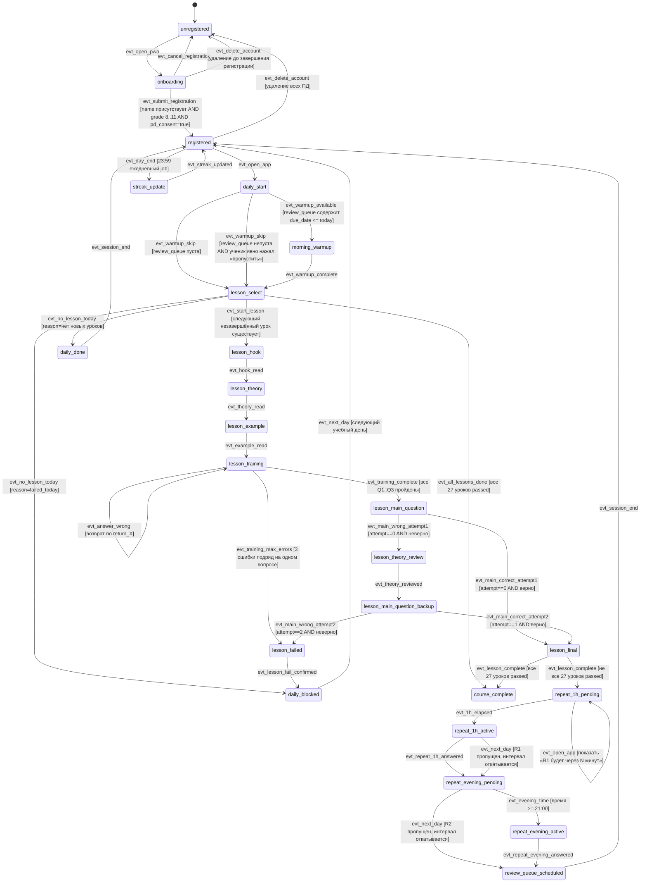

# Спека: Роль «Ученик» и прохождение урока в PWA

**Версия:** v2  
**Дата:** 2026-06-16  
**Автор:** Агент 3 (Архитектор системы)  
**Исправлено по ревью А4 v1**  
**Источники:** Methodology v2.1 > Project Brain v3.2 > CLAUDE.md  
**Область:** ученик end-to-end (регистрация → урок → повторения → mastery). Родитель / учитель / репетитор — вне охвата.  
**Проверяют:** Агент 4 (Критик системы) + validator.py

---

## 0. Открытые развилки (решает фаундер)

| # | Развилка | Почему блокер |
|---|----------|---------------|
| D-1 | Нужна ли возможность смены имени и/или класса после регистрации? | Влияет на наличие операции `write` по ресурсу `user_profile` |
| D-2 | Порог «3 ошибки подряд на закреплении» — применяется ко всему блоку тренировки (Q1–Q3 суммарно) или только к конкретному вопросу? | Методология §2.2.1 говорит «3 ошибки подряд», Brain §5.3 — «на закреплении». Трактовка не однозначна: спека трактует как «3 ошибки на один тренировочный вопрос подряд (внутри одной итерации возврата)». Если иное — уточнить. |
| D-3 | Логика «передышки» (streak freeze): 1 в неделю, но когда именно активируется — автоматически или ученик нажимает кнопку? | Влияет на FSM-переход `streak_freeze_apply`. Спека принимает: **автоматически** — система применяет передышку при первом пропуске, если лимит не исчерпан. |
| D-4 | Утренняя разминка (R3 / review_queue): запускается строго в 08:00 или при первом входе в день? | Влияет на архитектуру push + scheduler. Спека принимает: push в 08:00, но разминка доступна при любом входе до конца учебного дня. |
| D-5 | Что показывать ученику, если он открывает PWA без интернета в момент прохождения урока (не закэшированный контент)? | Офлайн-режим service worker — отдельная спека. Здесь: если контент не в кэше — показать заглушку «нет соединения» без потери прогресса. |

---

## 1. Словарь сущностей

| Сущность | Описание | Ключевые атрибуты | Связи |
|----------|----------|-------------------|-------|
| **User** | Аккаунт пользователя любой роли | `id`, `role` (student/parent/teacher/tutor), `name`, `grade` (только student), `created_at`, `pwa_push_token`, `pd_consent_at` (datetime — момент принятия политики ПД), `pd_consent_version` (строка версии политики) | 1:1 → StudentProfile (если role=student) |
| **StudentProfile** | Расширенный профиль ученика | `user_id`, `current_lesson_id`, `course_started_at`, `last_active_at` (datetime, для контроля 90-дневного периода неактивности) | 1:1 → User; 1:N → Progress; 1:1 → Streak; 1:N → ReviewQueue |
| **Lesson** | Метаданные урока (читаются из CSV) | `lesson_id` (string, без точек), `block_id`, `title`, `total_messages` | 1:N → LessonMessage |
| **LessonMessage** | Одно сообщение урока из CSV | `message_id` (с префиксом для блоков 1.2+), `lesson_id`, `stage` (hook/theory/example/training/main_question/main_question_backup/final/lesson_failed/repeat_1h/repeat_evening/repeat_morning), `text` (HTML), `option_a..d`, `correct_answer`, `feedback_a..d`, `return_a..d` | N:1 → Lesson |
| **Progress** | Состояние прохождения урока учеником | `id`, `user_id`, `lesson_id`, `status` (not_started/in_progress/passed/failed_today), `main_question_attempts` (0..3), `training_errors` (JSON: счётчик ошибок по вопросу), `current_message_id`, `started_at`, `completed_at`, `passed_on_attempt` (1/2/null) | N:1 → User; N:1 → Lesson |
| **Streak** | Счётчик непрерывных учебных дней | `user_id`, `current_streak`, `longest_streak`, `last_active_date`, `freeze_used_this_week` (bool); сброс `freeze_used_this_week` происходит в job `evt_day_end` при `date.weekday() == 0` (понедельник) | 1:1 → StudentProfile |
| **ReviewQueue** | Очередь тем для повторения (interval ≥ 1 день) | `id`, `user_id`, `lesson_id`, `reason` (passed_attempt_2 / interval_1d / interval_3d / interval_7d / interval_14d / interval_30d), `due_date`, `done` | N:1 → StudentProfile |
| **ReminderState** | Флаги триггеров push-напоминаний | `user_id`, `last_notified_at`, `skip_days_count`, `freeze_applied_date` | 1:1 → StudentProfile |
| **DailySession** | Агрегат активности за учебный день | `user_id`, `date`, `lessons_completed`, `reviews_completed`, `morning_warmup_done` | N:1 → User |
| **Session** | Сессионный токен аутентификации | `token` (httpOnly cookie, 256-bit random), `user_id`, `created_at`, `expires_at` (created_at + 30 дней), `revoked` (bool) | N:1 → User |

### Инварианты модели данных

- Регистрация собирает только: **имя** + **класс** + **согласие на политику ПД** (152-ФЗ, минимизация ПД). Никакого телефона/email.
- `lesson_id` никогда не содержит точку (хранится keeper.py).
- `return_X` — дословно совпадает с существующим `message_id` того же урока (хранится keeper.py).
- `correct_answer` — английская заглавная буква A/B/C/D (хранится keeper.py).
- При регистрации ученика с `grade=8` — система показывает предупреждение «Курс рассчитан на учеников 9–11 классов; для 8 класса часть тем может быть рановата» и требует явного подтверждения для продолжения. Регистрация не блокируется, но предупреждение обязательно.
- Аккаунт неактивен, если `StudentProfile.last_active_at < now - 90 дней` (см. F-11).

---

## 2. Конечный автомат (FSM) — роль «Ученик»

### 2а. Mermaid-диаграмма



> **Примечание по FSM:** Состояния `lesson_theory`, `lesson_example`, `lesson_training`, `lesson_main_question`, `lesson_theory_review`, `lesson_main_question_backup`, `lesson_final`, `lesson_failed` — sub-states внутри макро-состояния «в уроке». Для validator.py они развёрнуты плоско (см. YAML ниже).

---

### 2б. YAML-блок для validator.py

```yaml
role: student
states:
  - id: unregistered
    type: start
  - id: onboarding
    type: normal
  - id: registered
    type: normal
  - id: daily_start
    type: normal
  - id: morning_warmup
    type: normal
  - id: lesson_select
    type: normal
  - id: lesson_hook
    type: normal
  - id: lesson_theory
    type: normal
  - id: lesson_example
    type: normal
  - id: lesson_training
    type: normal
  - id: lesson_main_question
    type: normal
  - id: lesson_theory_review
    type: normal
  - id: lesson_main_question_backup
    type: normal
  - id: lesson_final
    type: normal
  - id: lesson_failed
    type: normal
  - id: repeat_1h_pending
    type: normal
  - id: repeat_1h_active
    type: normal
  - id: repeat_evening_pending
    type: normal
  - id: repeat_evening_active
    type: normal
  - id: review_queue_scheduled
    type: normal
  - id: daily_blocked
    type: normal
  - id: daily_done
    type: normal
  - id: streak_update
    type: normal
  - id: course_complete
    type: end

events:
  - id: evt_open_pwa
  - id: evt_submit_registration
  - id: evt_cancel_registration
  - id: evt_delete_account
  - id: evt_open_app
  - id: evt_warmup_available
  - id: evt_warmup_skip
  - id: evt_warmup_complete
  - id: evt_start_lesson
  - id: evt_no_lesson_today
  - id: evt_all_lessons_done
  - id: evt_hook_read
  - id: evt_theory_read
  - id: evt_example_read
  - id: evt_answer_correct
  - id: evt_answer_wrong
  - id: evt_training_complete
  - id: evt_training_max_errors
  - id: evt_main_correct_attempt1
  - id: evt_main_wrong_attempt1
  - id: evt_main_correct_attempt2
  - id: evt_main_wrong_attempt2
  - id: evt_theory_reviewed
  - id: evt_lesson_complete
  - id: evt_lesson_fail_confirmed
  - id: evt_1h_elapsed
  - id: evt_repeat_1h_answered
  - id: evt_evening_time
  - id: evt_repeat_evening_answered
  - id: evt_session_end
  - id: evt_next_day
  - id: evt_day_end
  - id: evt_streak_updated

transitions:
  # --- Регистрация ---
  - from: unregistered
    event: evt_open_pwa
    to: onboarding
    guard: null

  - from: onboarding
    event: evt_submit_registration
    to: registered
    guard: "name присутствует AND grade в диапазоне 8..11 AND pd_consent=true; при grade=8 — предупреждение подтверждено"

  - from: onboarding
    event: evt_cancel_registration
    to: unregistered
    guard: null

  - from: onboarding
    event: evt_delete_account
    to: unregistered
    guard: "удаление до завершения регистрации — очистка временных данных сессии"

  # --- Удаление аккаунта (152-ФЗ) ---
  - from: registered
    event: evt_delete_account
    to: unregistered
    guard: "удалить User, StudentProfile, Progress, Streak, ReviewQueue, ReminderState, DailySession, Session; инвалидировать push_token; ответить 204"

  # --- Вход в приложение ---
  - from: registered
    event: evt_open_app
    to: daily_start
    guard: "обновить StudentProfile.last_active_at = now"

  # --- Утренняя разминка (взаимоисключающие Guard-ы) ---
  - from: daily_start
    event: evt_warmup_available
    to: morning_warmup
    guard: "review_queue содержит записи с due_date <= today"
    # Этот Guard срабатывает ТОЛЬКО при непустой queue; evt_warmup_skip в этом случае не активен автоматически

  - from: daily_start
    event: evt_warmup_skip
    to: lesson_select
    guard: "review_queue пуста (нет записей с due_date <= today)"
    # Guard взаимоисключает с evt_warmup_available: один из двух переходов активен, не оба

  - from: daily_start
    event: evt_warmup_skip
    to: lesson_select
    guard: "review_queue непуста AND ученик явно нажал кнопку «Пропустить разминку»"
    # Явный пользовательский выбор; evt_warmup_available был доступен, ученик отказался

  - from: morning_warmup
    event: evt_warmup_complete
    to: lesson_select
    guard: null

  # --- Выбор урока ---
  - from: lesson_select
    event: evt_start_lesson
    to: lesson_hook
    guard: "следующий незавершённый урок существует AND Progress.status != failed_today"

  - from: lesson_select
    event: evt_no_lesson_today
    to: daily_done
    guard: "reason=нет новых уроков (все пройдены или нет в расписании)"

  - from: lesson_select
    event: evt_no_lesson_today
    to: daily_blocked
    guard: "reason=failed_today (Progress.status=failed_today для следующего урока)"

  - from: lesson_select
    event: evt_all_lessons_done
    to: course_complete
    guard: "все 27 уроков имеют Progress.status=passed"

  # --- Прохождение урока ---
  - from: lesson_hook
    event: evt_hook_read
    to: lesson_theory
    guard: null

  - from: lesson_theory
    event: evt_theory_read
    to: lesson_example
    guard: null

  - from: lesson_example
    event: evt_example_read
    to: lesson_training
    guard: null

  - from: lesson_training
    event: evt_answer_correct
    to: lesson_training
    guard: "остались непройденные тренировочные вопросы"

  - from: lesson_training
    event: evt_answer_correct
    to: lesson_main_question
    guard: "все тренировочные вопросы (Q1..Q3) пройдены"

  - from: lesson_training
    event: evt_answer_wrong
    to: lesson_training
    guard: "возврат по return_X к теории; счётчик ошибок на этот вопрос < 3"

  - from: lesson_training
    event: evt_training_complete
    to: lesson_main_question
    guard: null

  - from: lesson_training
    event: evt_training_max_errors
    to: lesson_failed
    guard: "счётчик ошибок на один тренировочный вопрос == 3 подряд"

  # --- Главный вопрос (mastery learning) ---
  - from: lesson_main_question
    event: evt_main_correct_attempt1
    to: lesson_final
    guard: "main_question_attempts == 0 AND ответ верен"

  - from: lesson_main_question
    event: evt_main_wrong_attempt1
    to: lesson_theory_review
    guard: "main_question_attempts == 0 AND ответ неверен"

  - from: lesson_theory_review
    event: evt_theory_reviewed
    to: lesson_main_question_backup
    guard: null

  - from: lesson_main_question_backup
    event: evt_main_correct_attempt2
    to: lesson_final
    guard: "main_question_attempts == 1 AND ответ верен; side-effect: добавить в review_queue (reason=passed_attempt_2, due_date=завтра утром)"
    # passed_attempt_2: добавляется ТОЛЬКО при 2-й попытке; при 1-й попытке (passed_attempt_1) — НЕ добавляется

  - from: lesson_main_question_backup
    event: evt_main_wrong_attempt2
    to: lesson_failed
    guard: "main_question_attempts == 2 AND ответ неверен"

  # --- Финал и провал ---
  - from: lesson_final
    event: evt_lesson_complete
    to: course_complete
    guard: "все 27 уроков имеют Progress.status=passed (проверка ПОСЛЕ записи текущего урока как passed)"
    # side-effect: записать Progress.status=passed; обновить Streak; если passed_attempt_1 — добавить interval 1/3/7/14/30 дней в review_queue; если passed_attempt_2 — interval уже добавлен на предыдущем шаге

  - from: lesson_final
    event: evt_lesson_complete
    to: repeat_1h_pending
    guard: "НЕ все 27 уроков имеют Progress.status=passed"
    # side-effect: записать Progress.status=passed; обновить Streak; запланировать R1 (1ч), R2 (~21:00); добавить interval 1/3/7/14/30 в review_queue (если passed_attempt_1); если passed_attempt_2 — interval уже добавлен, дополнительно не добавляется

  - from: lesson_failed
    event: evt_lesson_fail_confirmed
    to: daily_blocked
    guard: "записать Progress.status=failed_today; добавить урок в review_queue (reason=interval_1d, due_date=tomorrow)"
    # Автоматическое применение evt_lesson_fail_confirmed при открытии PWA: если Progress.status=in_progress AND main_question_attempts==2 → fsm_service автоматически генерирует evt_lesson_fail_confirmed без участия пользователя

  # --- Повторения R1/R2 ---
  - from: repeat_1h_pending
    event: evt_open_app
    to: repeat_1h_pending
    guard: "самопетля: показать сообщение «R1 будет через N минут» (N = (repeat_1h_due_at - now).minutes)"

  - from: repeat_1h_pending
    event: evt_1h_elapsed
    to: repeat_1h_active
    guard: "прошёл 1 час после evt_lesson_complete (scheduler или push)"

  - from: repeat_1h_active
    event: evt_repeat_1h_answered
    to: repeat_evening_pending
    guard: null

  - from: repeat_1h_active
    event: evt_next_day
    to: repeat_evening_pending
    guard: "R1 пропущен (ученик не открыл PWA вовремя); интервал R1 откатывается: добавить в review_queue повторно с уменьшенным интервалом"

  - from: repeat_evening_pending
    event: evt_evening_time
    to: repeat_evening_active
    guard: "текущее время >= 21:00 локального времени ученика"

  - from: repeat_evening_pending
    event: evt_next_day
    to: review_queue_scheduled
    guard: "R2 пропущен (ученик не открыл PWA вечером); интервал откатывается на шаг назад в review_queue"

  - from: repeat_evening_active
    event: evt_repeat_evening_answered
    to: review_queue_scheduled
    guard: "добавить интервальные повторения в review_queue (1/3/7/14/30 дней); при passed_attempt_2 — interval уже добавлен ранее, не дублировать"

  # --- Завершение сессии ---
  - from: review_queue_scheduled
    event: evt_session_end
    to: registered
    guard: null

  - from: daily_done
    event: evt_session_end
    to: registered
    guard: null

  - from: daily_blocked
    event: evt_next_day
    to: registered
    guard: "наступил следующий учебный день (scheduler)"

  # --- Streak ---
  - from: registered
    event: evt_day_end
    to: streak_update
    guard: "ежедневный job 23:59; при date.weekday()==0 (понедельник) — сбросить Streak.freeze_used_this_week=false"

  - from: streak_update
    event: evt_streak_updated
    to: registered
    guard: "если DailySession.lessons_completed >= 1 ИЛИ reviews_completed >= 1: streak+1; иначе: применить freeze (если freeze_used_this_week=false) или сбросить streak в 0"

# Комментарии по необработанным событиям:
# evt_open_pwa в состоянии registered: невозможно — пользователь уже зарегистрирован и авторизован
# evt_submit_registration в состоянии registered: невозможно — повторная регистрация не поддерживается
# evt_start_lesson в состоянии daily_blocked: невозможно — заблокировано до следующего дня (mastery learning)
# evt_answer_wrong на главном вопросе 3-й раз без перехода через lesson_theory_review: невозможно — архитектурно исключено
# evt_delete_account в состояниях урока (lesson_*): невозможно в v1 — удаление доступно только из registered или onboarding
```

---

## 3. Матрица прав

### 3а. Markdown-таблица

| Роль | Ресурс | Операция | Allow | Условие |
|------|--------|----------|-------|---------|
| student | user_profile_own | read | true | user_id совпадает с аутентифицированным |
| student | user_profile_own | write | false | развилка D-1 не решена; deny до решения |
| student | user_profile_own | create | true | только при регистрации, role=student |
| student | user_profile_own | delete | true | право на удаление всех своих ПД (152-ФЗ) |
| student | user_profile_other | read | false | — |
| student | user_profile_other | write | false | — |
| student | user_profile_other | create | false | — |
| student | user_profile_other | delete | false | — |
| student | user_account_own | delete | true | каскадное удаление всех связанных ПД (152-ФЗ) |
| student | lesson_content | read | true | lesson принадлежит курсу; только для чтения из CSV |
| student | lesson_content | write | false | — |
| student | lesson_content | create | false | — |
| student | lesson_content | delete | false | — |
| student | progress_own | read | true | user_id совпадает |
| student | progress_own | write | true | только через FSM-эндпоинты бэкенда; прямой PUT/PATCH запрещён |
| student | progress_own | create | true | при старте урока через FSM |
| student | progress_own | delete | false | — |
| student | progress_other | read | false | — |
| student | progress_other | write | false | — |
| student | progress_other | create | false | — |
| student | progress_other | delete | false | — |
| student | streak_own | read | true | user_id совпадает |
| student | streak_own | write | false | только бэкенд-job (day_end scheduler) |
| student | streak_own | create | false | создаётся автоматически при регистрации |
| student | streak_own | delete | false | — |
| student | streak_other | read | false | — |
| student | streak_other | write | false | — |
| student | streak_other | create | false | — |
| student | streak_other | delete | false | — |
| student | review_queue_own | read | true | user_id совпадает |
| student | review_queue_own | write | false | только через FSM-переходы |
| student | review_queue_own | create | false | создаётся через FSM |
| student | review_queue_own | delete | false | — |
| student | review_queue_other | read | false | — |
| student | review_queue_other | write | false | — |
| student | review_queue_other | create | false | — |
| student | review_queue_other | delete | false | — |
| student | reminder_state_own | read | true | user_id совпадает |
| student | reminder_state_own | write | false | управляется бэкендом и service worker |
| student | reminder_state_own | create | false | — |
| student | reminder_state_own | delete | false | — |
| student | daily_session_own | read | true | user_id совпадает |
| student | daily_session_own | write | false | только бэкенд-агрегатор |
| student | daily_session_own | create | false | — |
| student | daily_session_own | delete | false | — |
| student | links_own_code | read | true | только свой код — для показа родителю/репетитору |
| student | links_own_code | write | false | — |
| student | links_own_code | create | true | генерация короткого кода для привязки взрослого |
| student | links_own_code | delete | false | — |
| student | links_details | read | false | ученик не видит список привязанных взрослых в v1 |
| student | links_details | write | false | — |
| student | links_details | create | false | — |
| student | links_details | delete | false | — |
| student | classes | read | false | — |
| student | classes | write | false | — |
| student | classes | create | false | — |
| student | classes | delete | false | — |
| student | push_token_own | read | false | токен не возвращается в API-ответах клиенту |
| student | push_token_own | write | true | при явном согласии пользователя на push-уведомления |
| student | push_token_own | create | true | при регистрации push-подписки |
| student | push_token_own | delete | true | при отзыве согласия на push |
| student | session_own | read | false | httpOnly cookie; недоступен JS |
| student | session_own | write | false | управляется бэкендом |
| student | session_own | create | true | при успешной регистрации или re-auth |
| student | session_own | delete | true | выход из аккаунта (logout); при evt_delete_account |

### 3б. YAML-блок

```yaml
permissions:
  # --- user_profile_own ---
  - role: student
    resource: user_profile_own
    operation: read
    allow: true
    guard: "user_id совпадает с аутентифицированным"

  - role: student
    resource: user_profile_own
    operation: write
    allow: false
    guard: null  # развилка D-1 не решена; deny until resolved

  - role: student
    resource: user_profile_own
    operation: create
    allow: true
    guard: "только при регистрации, role=student"

  - role: student
    resource: user_profile_own
    operation: delete
    allow: true
    guard: "каскадное удаление всех ПД через evt_delete_account (152-ФЗ)"

  # --- user_profile_other ---
  - role: student
    resource: user_profile_other
    operation: read
    allow: false
    guard: null

  - role: student
    resource: user_profile_other
    operation: write
    allow: false
    guard: null

  - role: student
    resource: user_profile_other
    operation: create
    allow: false
    guard: null

  - role: student
    resource: user_profile_other
    operation: delete
    allow: false
    guard: null

  # --- user_account_own (право на удаление аккаунта целиком, 152-ФЗ) ---
  - role: student
    resource: user_account_own
    operation: delete
    allow: true
    guard: "каскадное удаление: User, StudentProfile, Progress, Streak, ReviewQueue, ReminderState, DailySession, Session; инвалидация push_token"

  - role: student
    resource: user_account_own
    operation: read
    allow: false
    guard: null

  - role: student
    resource: user_account_own
    operation: write
    allow: false
    guard: null

  - role: student
    resource: user_account_own
    operation: create
    allow: false
    guard: null

  # --- lesson_content ---
  - role: student
    resource: lesson_content
    operation: read
    allow: true
    guard: "lesson принадлежит курсу; контент только для чтения из CSV"

  - role: student
    resource: lesson_content
    operation: write
    allow: false
    guard: null

  - role: student
    resource: lesson_content
    operation: create
    allow: false
    guard: null

  - role: student
    resource: lesson_content
    operation: delete
    allow: false
    guard: null

  # --- progress_own ---
  - role: student
    resource: progress_own
    operation: read
    allow: true
    guard: "user_id совпадает"

  - role: student
    resource: progress_own
    operation: write
    allow: true
    guard: "только через FSM-эндпоинты бэкенда; прямой PUT/PATCH на progress запрещён"

  - role: student
    resource: progress_own
    operation: create
    allow: true
    guard: "при старте урока через FSM"

  - role: student
    resource: progress_own
    operation: delete
    allow: false
    guard: null

  # --- progress_other ---
  - role: student
    resource: progress_other
    operation: read
    allow: false
    guard: null

  - role: student
    resource: progress_other
    operation: write
    allow: false
    guard: null

  - role: student
    resource: progress_other
    operation: create
    allow: false
    guard: null

  - role: student
    resource: progress_other
    operation: delete
    allow: false
    guard: null

  # --- streak_own ---
  - role: student
    resource: streak_own
    operation: read
    allow: true
    guard: "user_id совпадает"

  - role: student
    resource: streak_own
    operation: write
    allow: false
    guard: "только бэкенд-job (day_end scheduler)"

  - role: student
    resource: streak_own
    operation: create
    allow: false
    guard: "создаётся автоматически при регистрации"

  - role: student
    resource: streak_own
    operation: delete
    allow: false
    guard: null

  # --- streak_other ---
  - role: student
    resource: streak_other
    operation: read
    allow: false
    guard: null

  - role: student
    resource: streak_other
    operation: write
    allow: false
    guard: null

  - role: student
    resource: streak_other
    operation: create
    allow: false
    guard: null

  - role: student
    resource: streak_other
    operation: delete
    allow: false
    guard: null

  # --- review_queue_own ---
  - role: student
    resource: review_queue_own
    operation: read
    allow: true
    guard: "user_id совпадает"

  - role: student
    resource: review_queue_own
    operation: write
    allow: false
    guard: "только через FSM-переходы"

  - role: student
    resource: review_queue_own
    operation: create
    allow: false
    guard: "создаётся через FSM"

  - role: student
    resource: review_queue_own
    operation: delete
    allow: false
    guard: null

  # --- review_queue_other ---
  - role: student
    resource: review_queue_other
    operation: read
    allow: false
    guard: null

  - role: student
    resource: review_queue_other
    operation: write
    allow: false
    guard: null

  - role: student
    resource: review_queue_other
    operation: create
    allow: false
    guard: null

  - role: student
    resource: review_queue_other
    operation: delete
    allow: false
    guard: null

  # --- reminder_state_own ---
  - role: student
    resource: reminder_state_own
    operation: read
    allow: true
    guard: "user_id совпадает"

  - role: student
    resource: reminder_state_own
    operation: write
    allow: false
    guard: "управляется бэкендом и service worker"

  - role: student
    resource: reminder_state_own
    operation: create
    allow: false
    guard: null

  - role: student
    resource: reminder_state_own
    operation: delete
    allow: false
    guard: null

  # --- daily_session_own ---
  - role: student
    resource: daily_session_own
    operation: read
    allow: true
    guard: "user_id совпадает"

  - role: student
    resource: daily_session_own
    operation: write
    allow: false
    guard: "только бэкенд-агрегатор"

  - role: student
    resource: daily_session_own
    operation: create
    allow: false
    guard: null

  - role: student
    resource: daily_session_own
    operation: delete
    allow: false
    guard: null

  # --- links_own_code ---
  - role: student
    resource: links_own_code
    operation: read
    allow: true
    guard: "только свой код — для показа родителю/репетитору"

  - role: student
    resource: links_own_code
    operation: write
    allow: false
    guard: null

  - role: student
    resource: links_own_code
    operation: create
    allow: true
    guard: "генерация короткого кода для привязки взрослого"

  - role: student
    resource: links_own_code
    operation: delete
    allow: false
    guard: null

  # --- links_details ---
  - role: student
    resource: links_details
    operation: read
    allow: false
    guard: "ученик не видит список привязанных взрослых в v1"

  - role: student
    resource: links_details
    operation: write
    allow: false
    guard: null

  - role: student
    resource: links_details
    operation: create
    allow: false
    guard: null

  - role: student
    resource: links_details
    operation: delete
    allow: false
    guard: null

  # --- classes ---
  - role: student
    resource: classes
    operation: read
    allow: false
    guard: null

  - role: student
    resource: classes
    operation: write
    allow: false
    guard: null

  - role: student
    resource: classes
    operation: create
    allow: false
    guard: null

  - role: student
    resource: classes
    operation: delete
    allow: false
    guard: null

  # --- push_token_own ---
  - role: student
    resource: push_token_own
    operation: read
    allow: false
    guard: "токен не возвращается в API-ответах клиенту"

  - role: student
    resource: push_token_own
    operation: write
    allow: true
    guard: "при явном согласии пользователя на push-уведомления"

  - role: student
    resource: push_token_own
    operation: create
    allow: true
    guard: "при регистрации push-подписки"

  - role: student
    resource: push_token_own
    operation: delete
    allow: true
    guard: "при отзыве согласия на push"

  # --- session_own ---
  - role: student
    resource: session_own
    operation: read
    allow: false
    guard: "httpOnly cookie; недоступен JS"

  - role: student
    resource: session_own
    operation: write
    allow: false
    guard: "управляется бэкендом"

  - role: student
    resource: session_own
    operation: create
    allow: true
    guard: "при успешной регистрации или повторной аутентификации по существующему токену"

  - role: student
    resource: session_own
    operation: delete
    allow: true
    guard: "выход из аккаунта (logout) или evt_delete_account"
```

---

## 4. Межролевые сценарии

> Охват v2: только роль «ученик». Сценарии с другими ролями — в будущих спеках.

---

### Сценарий S-01: Регистрация нового ученика

**Участники:** ученик  
**Предусловие:** пользователь открыл PWA впервые, аккаунта нет  

| Шаг | Актор | Действие | Результат |
|-----|-------|----------|-----------|
| 1 | Ученик | Открывает PWA по ссылке | Система: `evt_open_pwa` → состояние `onboarding` |
| 2 | Система | Показывает экран регистрации: поля «Как тебя зовут?» и «В каком ты классе?» (выбор 8–11); показывает ссылку на Политику обработки персональных данных; показывает чекбокс «Я даю согласие на обработку ПД» (обязателен) | Экран регистрации отображён |
| 2а | Система | Если ученик выбирает класс «8» — отображает предупреждение: «Курс рассчитан на 9–11 классы; для 8 класса часть тем может быть рановата. Продолжить?» | Предупреждение показано, кнопка подтверждения |
| 3 | Ученик | Вводит имя «Иван», выбирает класс «9», ставит галочку согласия на ПД | Форма заполнена; кнопка «Начать» активна |
| 4 | Ученик | Нажимает «Начать» | `evt_submit_registration` |
| 5 | Система | Проверяет: name не пустое, grade в 8..11, pd_consent=true; бэкенд проверяет уникальный constraint (имя+время создания) для идемпотентности; фронтенд блокирует кнопку после первого нажатия | Валидация пройдена |
| 6 | Система | Создаёт User (role=student, name=Иван, grade=9, pd_consent_at=now, pd_consent_version=«v1»), StudentProfile, Streak (current=0), DailySession, Session (httpOnly cookie, 30 дней) | БД обновлена |
| 7 | Система | Переводит в `registered`, показывает первый урок | Состояние `registered` → `daily_start` → `lesson_select` |

**Постусловие:** User и StudentProfile созданы; ПД — только имя и класс; согласие зафиксировано с timestamp.

---

### Сценарий S-02: Прохождение урока, главный вопрос с 1-й попытки

**Участники:** ученик  
**Предусловие:** ученик зарегистрирован; Progress для урока 1.1 — not_started  

| Шаг | Актор | Действие | Результат |
|-----|-------|----------|-----------|
| 1 | Ученик | Открывает PWA | `evt_open_app` → `daily_start`; обновляется `last_active_at` |
| 2 | Система | Проверяет review_queue: пуста | `evt_warmup_skip` (guard: queue пуста) → `lesson_select` |
| 3 | Ученик | Нажимает «Начать урок 1.1» | `evt_start_lesson` → `lesson_hook` |
| 4 | Система | Отображает hook-сообщение | — |
| 5 | Ученик | Читает, нажимает «Далее» | `evt_hook_read` → `lesson_theory` |
| 6 | Система | Показывает theory-сообщения (1–2 экрана) | — |
| 7 | Ученик | Читает, нажимает «Далее» | `evt_theory_read` → `lesson_example` |
| 8 | Система | Показывает example | — |
| 9 | Ученик | «Далее» | `evt_example_read` → `lesson_training` |
| 10 | Система | Показывает Q1 (training) | — |
| 11 | Ученик | Отвечает верно на Q1, Q2, Q3 | `evt_answer_correct` × 3 → после Q3: `evt_training_complete` → `lesson_main_question` |
| 12 | Система | Показывает главный вопрос (stage: main_question) | — |
| 13 | Ученик | Отвечает верно с 1-й попытки | `evt_main_correct_attempt1` → `lesson_final` |
| 14 | Система | Показывает финал, обновляет Streak +1, записывает Progress.status=passed, passed_on_attempt=1 | — |
| 15 | Система | Проверяет: не все 27 уроков passed → `evt_lesson_complete` → `repeat_1h_pending`; планирует R1 (через 1 ч), R2 (~21:00); добавляет в review_queue interval_1d/3d/7d/14d/30d (passed_attempt_1 — passed_attempt_2 запись НЕ добавляется); записывает DailySession | Урок полностью засчитан |

**Постусловие:** Progress.status=passed, passed_on_attempt=1; review_queue содержит interval-записи; запись passed_attempt_2 отсутствует.

---

### Сценарий S-03: Прохождение урока, главный вопрос со 2-й попытки

**Предусловие:** как S-02, но ученик ошибается на главном вопросе  

| Шаг | Актор | Действие | Результат |
|-----|-------|----------|-----------|
| 1–11 | — | Аналогично S-02 до шага 12 | `lesson_main_question` |
| 12 | Ученик | Отвечает неверно | `evt_main_wrong_attempt1` → `lesson_theory_review`; main_question_attempts=1 |
| 13 | Система | Показывает объяснение ошибки (feedback), затем возвращает к ключевому theory-сообщению (return_X) | — |
| 14 | Ученик | Перечитывает теорию, нажимает «Далее» | `evt_theory_reviewed` → `lesson_main_question_backup` |
| 15 | Система | Показывает резервный главный вопрос (stage: main_question_backup) | — |
| 16 | Ученик | Отвечает верно | `evt_main_correct_attempt2` → `lesson_final`; side-effect: добавить в review_queue (reason=passed_attempt_2, due_date=завтра утром) |
| 17 | Система | Показывает финал, Progress.status=passed, passed_on_attempt=2; при evt_lesson_complete добавляет interval 1/3/7/14/30 дней в review_queue; запись passed_attempt_2 уже есть, не дублировать | Урок засчитан |

**Постусловие:** Progress.status=passed, passed_on_attempt=2; review_queue содержит passed_attempt_2 + interval-записи (без дублирования).

---

### Сценарий S-04: Провал урока (исчерпаны попытки)

**Предусловие:** ученик на `lesson_main_question_backup`

| Шаг | Актор | Действие | Результат |
|-----|-------|----------|-----------|
| 1 | Ученик | Отвечает неверно | `evt_main_wrong_attempt2` → `lesson_failed` |
| 2 | Система | Показывает lesson_failed сообщение: «Вернёмся к этому завтра — так лучше запомнится» | — |
| 3 | Ученик | Подтверждает | `evt_lesson_fail_confirmed` → `daily_blocked` |
| 4 | Система | Записывает Progress.status=failed_today; добавляет урок в review_queue (reason=interval_1d, due_date=tomorrow); новые уроки сегодня недоступны | daily_blocked |
| 5 | Scheduler | Следующий учебный день | `evt_next_day` → `registered` |

**Постусловие:** сегодня новых уроков нет; завтра урок повторяется.

---

### Сценарий S-05: Утренняя разминка (R3 / review_queue)

**Предусловие:** ученик пришёл на следующий день; review_queue содержит записи с due_date <= today  

| Шаг | Актор | Действие | Результат |
|-----|-------|----------|-----------|
| 1 | Система | Отправляет push в 08:00 «Утренняя разминка» | — |
| 2 | Ученик | Открывает PWA | `evt_open_app` → `daily_start` |
| 3 | Система | Проверяет review_queue: есть записи с due_date <= today | `evt_warmup_available` → `morning_warmup` |
| 4 | Система | Показывает 3 вопроса interleaved из разных пройденных уроков | — |
| 5 | Ученик | Отвечает (верно/неверно — с объяснением) | — |
| 6 | Система | `evt_warmup_complete` → `lesson_select`; обновляет review_queue (done=true или сдвигает due_date если ошибка) | — |

**Постусловие:** review_queue обновлена; ученик переходит к новому уроку дня.

---

### Сценарий S-06: Тренировочный вопрос с ошибкой и возвратом к теории

**Предусловие:** ученик в состоянии `lesson_training`, отвечает на Q2 неверно  

| Шаг | Актор | Действие | Результат |
|-----|-------|----------|-----------|
| 1 | Ученик | Выбирает неверный вариант на Q2 | `evt_answer_wrong` |
| 2 | Система | Показывает feedback_X для неверного варианта; перемещает к сообщению return_X (theory/example); счётчик ошибок на Q2 = 1 | Состояние остаётся `lesson_training` |
| 3 | Ученик | Перечитывает теорию | — |
| 4 | Система | Показывает новый вопрос на тот же навык | — |
| 5 | Ученик | Отвечает верно | `evt_answer_correct` → продолжение тренировки |

**Постусловие:** прогресс по тренировке не сбрасывается полностью; ошибка зафиксирована в Progress.training_errors.

---

### Сценарий S-07: Streak — пропуск и передышка

**Предусловие:** ученик активен 5 дней подряд; пропускает 1 день; freeze_used_this_week=false  

| Шаг | Актор | Действие | Результат |
|-----|-------|----------|-----------|
| 1 | Scheduler | 23:59 — `evt_day_end` → `streak_update`; если понедельник — сбросить freeze_used_this_week=false | — |
| 2 | Система | DailySession за сегодня: lessons_completed=0, reviews_completed=0 | — |
| 3 | Система | freeze_used_this_week=false → автоматически применяет передышку: streak не сбрасывается, freeze_used_this_week=true | Streak сохранён |
| 4 | Ученик | Открывает PWA на следующий день | Видит сообщение «Использую передышку — счётчик сохранён» |

**Постусловие:** streak сохранён; следующий пропуск на той же неделе — streak сбрасывается в 0.

---

### Сценарий S-08: Удаление аккаунта (152-ФЗ)

**Участники:** ученик  
**Предусловие:** ученик зарегистрирован, находится в состоянии `registered`

| Шаг | Актор | Действие | Результат |
|-----|-------|----------|-----------|
| 1 | Ученик | Открывает настройки → «Удалить аккаунт» | Показывается экран подтверждения с предупреждением «Все данные будут удалены безвозвратно» |
| 2 | Ученик | Подтверждает удаление | `evt_delete_account` |
| 3 | Система | Каскадно удаляет: User, StudentProfile, Progress, Streak, ReviewQueue, ReminderState, DailySession, Session; инвалидирует push_token | Все ПД удалены |
| 4 | Система | Переходит в состояние `unregistered`; показывает экран «Аккаунт удалён» | Сессия завершена |

**Постусловие:** все ПД ученика удалены; аккаунт не восстановим.

---

## 5. Edge Cases

| id | Условие (что нестандартного) | Ожидаемое поведение системы |
|----|------------------------------|----------------------------|
| EC-01 | Ученик дважды нажимает «Далее» за доли секунды (дабл-клик) | Фронтенд блокирует кнопку после первого нажатия до получения ответа от бэкенда; повторный evt не создаётся; бэкенд использует уникальный constraint для идемпотентности |
| EC-02 | Ученик закрывает браузер в середине урока (между Q1 и Q2) | Progress.current_message_id сохранён при каждом FSM-переходе; при следующем входе урок продолжается с сохранённой позиции |
| EC-03 | Ученик одновременно открыл PWA в двух вкладках и отвечает на один вопрос в обеих | Бэкенд — единственный источник истины; первый запрос фиксирует переход, второй получает 409 Conflict; состояние не задваивается |
| EC-04 | R1-push приходит, ученик уже в уроке (parallel flow) | R1 остаётся в pending; показывается после завершения текущего урока или при следующем входе |
| EC-05 | Ученик отвечает на R1 неверно | Фиксируется ошибка; review_queue: интервал откатывается на шаг назад (Methodology §2.2); тема всплывёт раньше |
| EC-06 | Scheduler day_end запускается дважды за один день (баг infra) | Операция обновления Streak — идемпотентна: проверка `last_active_date == today` блокирует повторное применение |
| EC-07 | Ученик не выдал согласие на push | R1/R2 не отправляются через push; при следующем входе в PWA показывается баннер «Есть незавершённые повторения» |
| EC-08 | CSV для урока содержит отсутствующий return_X (message_id не существует) | keeper.py блокирует такой CSV до деплоя; если дошло до рантайма — движок логирует ошибку, показывает ученику theory с начала урока (safe fallback), не ломает FSM |
| EC-09 | Ученик пытается открыть урок через прямой URL, минуя FSM (daily_blocked) | Бэкенд проверяет Progress.status: если failed_today — возвращает 403 «этот урок доступен завтра» |
| EC-10 | 3 дня подряд урок проваливается (failed_today) | На 3-й день система мягко предлагает «давай освежим основу из предыдущего урока»; предыдущий урок добавляется в review_queue |
| EC-11 | Ученик прошёл все 27 уроков | `evt_all_lessons_done` → `course_complete`; показывается финальный экран с прогнозом балла ОГЭ |
| EC-12 | Ученик зарегистрировался, но никогда не запускал урок (ghost user) | Через 14 дней — напоминание; через 30 дней — финальный месседж; через 90 дней неактивности — предупреждение об удалении ПД; через 90+14 дней — удаление (см. F-11) |
| EC-13 | lesson_id в CSV содержит точку (баг продюсера) | keeper.py отклоняет CSV до деплоя; в рантайм не попадает |
| EC-14 | Ученик открывает PWA без интернета | Service worker отдаёт кэшированную shell; если текущий урок закэширован — доступен офлайн; если нет — заглушка «нет соединения», Progress не теряется |
| EC-15 | correct_answer в CSV — строчная буква ('a' вместо 'A') | keeper.py блокирует; движок не получает невалидный CSV |
| EC-16 | Дабл-клик на кнопке «Начать» при регистрации | Фронтенд блокирует кнопку после первого нажатия; бэкенд использует unique constraint на (name, created_at с точностью до секунды) или idempotency key; дублирующий аккаунт не создаётся |
| EC-17 | Ученик открывает PWA после закрытия браузера на этапе lesson_failed (без подтверждения) | При открытии PWA: если Progress.status=in_progress AND main_question_attempts==2 → fsm_service автоматически генерирует evt_lesson_fail_confirmed; урок переводится в failed_today без участия пользователя |
| EC-18 | grade=8 при регистрации | Система показывает предупреждение «Курс рассчитан на 9–11 классы»; требует явного подтверждения; регистрация не блокируется после подтверждения |
| EC-19 | Ученик открывает PWA и review_queue непуста, но нажимает «Пропустить разминку» | Guard: evt_warmup_skip [review_queue непуста AND ученик явно нажал «Пропустить»] → lesson_select; разминка не проводится, запросы в queue остаются с теми же due_date |

---

## 6. Режимы отказа

| id | Триггер отказа | Поведение системы | Обратимо? |
|----|---------------|-------------------|-----------|
| F-01 | Бэкенд FastAPI недоступен (сервер упал) | Service worker отдаёт кэш; при попытке FSM-перехода — показывает «нет соединения, попробуй позже»; Progress не мутирует | Да — автоперезапуск Docker Compose; без потери данных |
| F-02 | БД SQLite повреждена (диск / внезапный shutdown) | Бэкенд не стартует; фаундер получает уведомление (healthcheck); данные из последнего бэкапа | Да — восстановление из daily backup; возможна потеря данных за < 24 ч |
| F-03 | CSV урока не загрузился в движок (синтаксическая ошибка) | Движок пропускает повреждённый урок; при попытке старта ученик получает «урок временно недоступен»; другие уроки работают | Да — исправить CSV + перезапуск движка |
| F-04 | Push-сервис браузера недоступен (FCM/APNS down) | R1/R2 push не доставляются; при следующем входе в PWA — баннер «есть незавершённые повторения»; Streak не страдает | Да — автоматически при восстановлении push-сервиса |
| F-05 | Scheduler (day_end / evening_time) не запустился | Streak не обновился, R2 не отправлен; при следующем запуске scheduler — проверяет пропущенные даты и применяет с флагом «запоздало» | Да — при следующем запуске scheduler |
| F-06 | Бесконечный цикл: return_X указывает на самого себя | keeper.py ловит в статическом анализе; если прорвалось — движок фиксирует max_retries=5 на одном message_id и переходит к следующему вопросу | Да — исправить CSV |
| F-07 | Двойная запись Progress (race condition при параллельных вкладках) | Бэкенд использует транзакцию + optimistic lock на Progress; проигравший запрос получает 409; фронтенд показывает «попробуй ещё раз» | Да — перезагрузка страницы |
| F-08 | review_queue переполнена (ученик не занимался 30+ дней) | При входе ученика — предлагается не вся очередь сразу, а порция (max 3 на сессию); остаток переносится; не блокирует новые уроки | Да — постепенно разгребается при ежедневных занятиях |
| F-09 | Ученик удаляет PWA с экрана (uninstall) | Данные на бэкенде сохранены; push_token инвалидирован; при повторном входе по ссылке — аккаунт восстанавливается через сессионный токен (если cookie не истёк) или по новой регистрации | Да — данные не теряются до evt_delete_account |
| F-10 | Утечка progress другого ученика через API (auth bug) | Все эндпоинты проверяют `user_id == authenticated_user_id` на бэкенде; матрица прав deny by default | Нет (не должно случиться); при обнаружении — аудит логов, уведомление фаундера, 152-ФЗ |
| F-11 | Неактивный аккаунт (last_active_at < now - 90 дней) | Scheduler job: за 14 дней до 90-дневного порога — отправить уведомление «Твои данные будут удалены через 14 дней из-за неактивности»; по истечении 90 дней — автоматическое каскадное удаление всех ПД (аналог evt_delete_account) | Нет (данные удалены безвозвратно) |
| F-12 | Запрос на удаление аккаунта не обработан (бэкенд недоступен) | Фронтенд показывает «Не удалось удалить аккаунт, попробуй позже»; запрос не повторяется автоматически; данные не удаляются до явного подтверждения пользователя при следующей попытке | Да — повторить запрос при восстановлении связи |

---

## 7. Раскладка каталогов

Зафиксирована для реализации данной задачи. Изменение структуры требует обновления этой спеки.

```
oge-math-project/
├── backend/
│   ├── main.py                  # FastAPI app entry point
│   ├── config.py                # env vars, constants
│   ├── db/
│   │   ├── database.py          # SQLite connection, session factory
│   │   ├── models.py            # SQLAlchemy ORM: User, StudentProfile, Progress, Streak, ReviewQueue, ReminderState, DailySession, Links, Classes, Session
│   │   └── migrations/          # Alembic migrations
│   ├── engine/
│   │   ├── csv_loader.py        # Чтение CSV уроков, валидация 19 колонок
│   │   ├── lesson_engine.py     # FSM движок урока: переходы, return_X, stage-логика
│   │   └── scheduler.py         # day_end job, evening push, R1 timer, 90-day cleanup
│   ├── routers/
│   │   ├── auth.py              # Регистрация (name + grade + pd_consent), сессия, logout, delete_account
│   │   ├── student.py           # FSM-эндпоинты: start_lesson, answer, next_message
│   │   ├── progress.py          # GET progress, streak, review_queue (read-only для клиента)
│   │   └── push.py              # Регистрация push_token
│   ├── services/
│   │   ├── fsm_service.py       # Бизнес-логика переходов FSM (mastery learning rules)
│   │   ├── streak_service.py    # Streak update, freeze logic, weekly reset
│   │   ├── review_service.py    # review_queue: добавление, выборка, обновление интервалов
│   │   ├── account_service.py   # Удаление аккаунта, cleanup неактивных пользователей
│   │   └── reminder_service.py  # Триггеры напоминаний
│   ├── auth/
│   │   └── deps.py              # Зависимости: get_current_user, check_student_owns_resource
│   └── tests/
│       ├── test_fsm.py          # FSM-переходы: happy path + edge cases
│       ├── test_mastery.py      # Логика 3 попыток, review_queue
│       ├── test_streak.py       # Streak update, freeze
│       ├── test_permissions.py  # Allow/deny по матрице прав
│       ├── test_csv_loader.py   # Загрузка CSV, невалидные файлы
│       └── test_account.py      # Удаление аккаунта, 152-ФЗ
├── frontend/
│   ├── public/
│   │   ├── manifest.json        # PWA manifest
│   │   └── sw.js                # Service worker (офлайн + push)
│   ├── src/
│   │   ├── main.tsx
│   │   ├── App.tsx
│   │   ├── pages/
│   │   │   ├── Onboarding.tsx   # Регистрация (имя + класс + чекбокс ПД + предупреждение grade=8)
│   │   │   ├── DailyStart.tsx   # Главный экран дня
│   │   │   ├── MorningWarmup.tsx
│   │   │   ├── LessonPlayer.tsx # Рендер сообщений урока, кнопки ответов
│   │   │   ├── AccountSettings.tsx  # Удаление аккаунта
│   │   │   └── CourseComplete.tsx
│   │   ├── components/
│   │   │   ├── MessageCard.tsx  # Рендер HTML-сообщения из CSV
│   │   │   ├── AnswerButtons.tsx
│   │   │   ├── StreakBadge.tsx
│   │   │   └── ProgressMap.tsx  # Карта знаний (блоки / уроки)
│   │   ├── hooks/
│   │   │   ├── useFSM.ts        # Взаимодействие с FSM-эндпоинтами бэкенда
│   │   │   ├── useLesson.ts
│   │   │   └── usePush.ts       # Запрос разрешения + регистрация push
│   │   ├── api/
│   │   │   └── client.ts        # HTTP-клиент (fetch wrapper)
│   │   └── i18n/
│   │       └── ru.ts            # Пользовательские тексты (не хардкодить в компонентах)
│   ├── vite.config.ts
│   └── tailwind.config.ts
├── content/                     # CSV уроков (уже есть, не трогать без keeper.py PASS)
│   ├── Контент_урок_1_1.csv
│   └── ...
├── tools/
│   ├── keeper.py                # Хранитель CSV (уже есть)
│   └── validator.py             # Валидатор FSM/матрицы прав
├── specs/
│   ├── student_lesson_fsm_v1.md
│   └── student_lesson_fsm_v2.md  # Этот файл
├── docker-compose.yml
├── .env.example                 # Шаблон переменных окружения (без секретов)
├── CLAUDE.md
├── Methodology_v2_1.md
├── Project_Brain_v3_2.md
└── .gitignore
```

---

## 8. Контракты между модулями (ключевые)

| Пара | Контракт |
|------|----------|
| csv_loader → lesson_engine | Загрузчик отдаёт `List[LessonMessage]`; если keeper.py-проверка провалилась — raises `InvalidCSVError`, урок не регистрируется |
| lesson_engine → fsm_service | FSM-сервис принимает `(user_id, event, payload)`, возвращает `(new_state, side_effects: List[SideEffect])`; side_effects исполняются транзакционно |
| fsm_service → review_service | При evt_lesson_complete (passed_attempt_1) — вызывает `review_service.enqueue(user_id, lesson_id, reason=interval_Xd, due_date)`; при evt_main_correct_attempt2 — вызывает `review_service.enqueue(reason=passed_attempt_2, due_date=tomorrow)`; дублирование проверяется по (user_id, lesson_id, reason, due_date) |
| scheduler → fsm_service | Scheduler вызывает fsm_service с событиями `evt_1h_elapsed`, `evt_evening_time`, `evt_day_end` через внутренний API (не через HTTP); при day_end в понедельник — передаёт флаг reset_freeze=True |
| routers → auth/deps | Каждый эндпоинт использует зависимость `get_current_user`; сессия — httpOnly cookie, срок жизни 30 дней от создания; `check_student_owns_resource(user_id, resource_user_id)` проверяет матрицу прав |
| auth → Session | При регистрации или re-auth: создать Session (token=256-bit random, expires_at=now+30d); установить httpOnly cookie; при logout или evt_delete_account — Session.revoked=True; при истечении expires_at — автоматическая инвалидация |
| scheduler → account_service | Ежедневный job проверяет `last_active_at < now - 90 дней`; за 14 дней до порога — отправляет предупреждение; по истечении — вызывает `account_service.delete_account(user_id)` |

---

*Спека v2 закрывает роль «ученик» end-to-end для реализации MVP PWA. Исправлены все блокеры и существенные замечания по ревью А4 v1. Роли родитель/учитель/репетитор, мессенджер-адаптеры — отдельные спеки после валидации ученической поверхности.*
