# Спека: Регистрация ученика в PWA (фаза onboarding)

**Версия:** v1
**Дата:** 2026-06-17
**Автор:** Агент 3 (Архитектор системы)
**Источники:** Methodology v2.1 (§1.4) > Project Brain v3.2 (Журнал решений 2026-06-17) > specs/student_lesson_fsm_v4.md
**Область:** регистрация ученика end-to-end — детализация фазы `onboarding` между `unregistered` и `registered` (со стыковкой в первый урок). Прохождение урока, повторения, mastery — вне охвата (см. v4).
**Стыковка:** этот документ ДЕТАЛИЗИРУЕТ переход `unregistered → onboarding → registered` из v4 (§2). Контракт v4 не ломается: имена сущностей (User, StudentProfile, Session, Consent-атрибуты), событие `evt_submit_registration` и конвенция `evt_*` сохранены. Внутри `onboarding` вводятся под-состояния, невидимые для FSM верхнего уровня v4: для v4 вся регистрация остаётся одним переходом `onboarding → registered`.
**Проверяют:** Агент 4 (Критик системы) + validator.py

---

## 0. Открытые развилки и зависимости (решает фаундер / юрист)

| # | Развилка / зависимость | Статус | Почему важно |
|---|------------------------|--------|--------------|
| D-6 | grade=8 → возраст <14 → согласие на ПД даёт законный представитель (152-ФЗ ст.9 ч.1). | **Закрыта продуктово в этой задаче через жёсткий гейт.** В production guard регистрации = `grade IN (9,10,11)`. grade=8 в production вообще не создаёт активный аккаунт ученика курса (жёсткий гейт, экран «возвращайся в сентябре»). Полная поддержка grade=8 с согласием представителя — НЕ в этой спеке. | Закрывает D-6 на уровне продукта: курс не работает с заведомо <14-летними. |
| Z-1 | **Форма согласия законного представителя для лиц <14 лет — ОТЛОЖЕНА (юр-проверка).** | **Незакрытая зависимость, НЕ блокирует эту спеку.** Опора: grade=8 закрыт жёстким гейтом; grade≥9 ≈ 14–15 лет, где согласие даёт сам субъект. Если юрист установит, что часть grade=9 моложе 14 — потребуется отдельная ветка согласия представителя; в текущей FSM её нет. Зафиксировано явно. | До юр-заключения нельзя гарантировать, что 100% grade=9 ≥14 лет. Риск приниматься фаундером осознанно. |
| Z-2 | Версия и текст Политики обработки ПД (`pd_consent_version`). | Незакрыта (контент/юр). НЕ блокирует FSM: спека фиксирует МЕХАНИЗМ (ссылка + обязательный чекбокс + запись `pd_consent_at`/`pd_consent_version`), не текст. | Текст политики — зона юриста/А8, не архитектора. |
| D-1 | Смена имени/класса после регистрации (наследие v4). | Остаётся открытой; в этой спеке регистрация только СОЗДАЁТ профиль. `write` по профилю — deny (как в v4). | Не относится к onboarding напрямую. |

> Продуктовые решения по полям, порядку, ветке-по-классу, экрану «курс не подходит» и согласию ПД — **утверждены фаундером (разбор А9, 2026-06-17)** и здесь НЕ переоткрываются.

---

## 1. Словарь сущностей

Сущности консистентны с v4. Новые/уточнённые атрибуты для onboarding помечены **(new)**.

| Сущность | Описание | Ключевые атрибуты | Связи |
|----------|----------|-------------------|-------|
| **User** | Аккаунт пользователя любой роли. Для онбординга — создаётся ТОЛЬКО при успешной регистрации (grade=9 или grade=10+ с подтверждением ОГЭ). | `id`, `role` (=student), `name` (никнейм/отображаемое имя; настоящее ФИО НЕ собирается), `grade` (9/10/11), `created_at`, `pwa_push_token` (null при регистрации), `pd_consent_at` (datetime — момент принятия политики ПД, обязателен), `pd_consent_version` (строка версии политики, обязательна) | 1:1 → StudentProfile |
| **StudentProfile** | Профиль ученика. На выходе регистрации `fsm_state=registered`, `current_lesson_id` = первый урок курса. | `user_id`, `current_lesson_id`, `course_started_at` (=now при регистрации), `last_active_at` (=now), `fsm_state` (=`registered`), `enrollment_reason` **(new)**: `grade9_direct` / `grade10plus_retake` — причина зачисления, для аналитики доходимости (не ПД) | 1:1 → User |
| **RegistrationDraft** **(new)** | Временное, НЕ персистентное состояние формы регистрации до отправки. Живёт только в памяти клиента + сессии онбординга на бэкенде; НЕ сохраняется как ПД в БД до `evt_submit_registration`. | `name_input`, `grade_input`, `ogeprep_answer` (для grade 10+: yes/no/null), `pd_consent_checked` (bool), `policy_version_shown` | — (не сохраняется при отмене/гейте; 152-ФЗ минимизация) |
| **Consent (атрибуты User)** | Не отдельная таблица — атрибуты `pd_consent_at` + `pd_consent_version` на User (как в v4). Фиксируют согласие на обработку ПД. | см. User | embedded в User |
| **Session** | Сессионный токен аутентификации. Создаётся ТОЛЬКО при успешной регистрации. | `token` (httpOnly cookie, 256-bit random), `user_id`, `created_at`, `expires_at` (=created_at + 30 дней), `revoked` (bool) | N:1 → User |
| **Lesson** | Метаданные первого урока (читается из CSV). Только `read` для определения `current_lesson_id`. | `lesson_id` (без точек), `block_id`, `title` | — (см. v4) |

### Инварианты регистрации

- Регистрация собирает РОВНО: **никнейм (name)** + **класс (grade)** + **согласие на политику ПД**. Ничего больше (152-ФЗ минимизация). Никакого телефона/email/ФИО/даты рождения. Контакты и привязки взрослых — отдельная задача «после первого урока», НЕ здесь.
- `name` — отображаемое имя/ник, не верифицируется как настоящее ФИО и не должно им быть.
- **Без согласия на ПД (`pd_consent_checked=false`) регистрация не завершается** — `evt_submit_registration` отклоняется guard-ом; User не создаётся.
- `User`, `StudentProfile`, `Session` создаются АТОМАРНО в одной транзакции только в исходе `grade9_direct` или `grade10plus_retake`. До этого момента ПД в БД не пишутся.
- **grade=8 (production): User НЕ создаётся.** Жёсткий гейт. Состояние `gate_grade8` — терминальный экран без активного аккаунта курса. RegistrationDraft уничтожается.
- **Экран «курс не подходит» (Methodology §1.4): информирующий, БЕЗ блокировки.** Ученик может всё равно продолжить регистрацию (кроме жёсткого гейта grade=8). Показывается для grade≥9 при самооценке «целюсь на 4–5» / «за 2 недели» / «не освоил арифметику», а также при grade 10+ ответе «не готовлюсь к ОГЭ».
- `policy_version_shown` записывается в `pd_consent_version` при отправке — фиксируем, какую именно версию политики ученик принял.
- `enrollment_reason` — НЕ ПД (не идентифицирует личность); используется для метрик доходимости.

---

## 2. Конечный автомат (FSM) — роль «ученик-регистрация»

Под-FSM фазы `onboarding`. `unregistered` — единственный start (стыковка с v4). Терминалы: `registered` (стык в v4 → первый урок), `unregistered` (отмена/гейт-выход), `gate_grade8` (жёсткий гейт, аккаунт курса не создан).

> Замечание о стыковке с v4: в v4 переход верхнего уровня `unregistered --evt_open_pwa--> onboarding --evt_submit_registration--> registered`. Здесь `onboarding` развёрнут. Финальный `evt_submit_registration` из под-состояния `consent_gate` соответствует ровно одному переходу v4 `onboarding → registered`. Прочие под-события (`evt_*`) — внутренние для onboarding и v4 не видны.

### 2а. Mermaid-диаграмма

```mermaid
stateDiagram-v2
    [*] --> unregistered

    unregistered --> name_entry : evt_open_pwa

    name_entry --> grade_entry : evt_name_submitted [name непустое после trim]
    name_entry --> unregistered : evt_cancel_registration

    grade_entry --> gate_grade8 : evt_grade_selected [grade==8 AND env==production — жёсткий гейт]
    grade_entry --> consent_gate : evt_grade_selected [grade==9]
    grade_entry --> ogeprep_check : evt_grade_selected [grade IN (10,11)]
    grade_entry --> name_entry : evt_back
    grade_entry --> unregistered : evt_cancel_registration

    ogeprep_check --> consent_gate : evt_ogeprep_yes [готовится/пересдаёт ОГЭ]
    ogeprep_check --> course_mismatch : evt_ogeprep_no [курс не подходит — без блокировки]
    ogeprep_check --> grade_entry : evt_back
    ogeprep_check --> unregistered : evt_cancel_registration

    course_mismatch --> consent_gate : evt_mismatch_continue [ученик решил всё равно начать]
    course_mismatch --> unregistered : evt_mismatch_leave
    course_mismatch --> unregistered : evt_cancel_registration

    consent_gate --> registered : evt_submit_registration [name непустое AND grade IN (9,10,11) AND pd_consent_checked==true]
    consent_gate --> grade_entry : evt_back
    consent_gate --> unregistered : evt_cancel_registration

    gate_grade8 --> unregistered : evt_gate_dismiss [аккаунт курса не создан; draft уничтожен]

    registered --> [*]
    unregistered --> [*]
    gate_grade8 --> [*]

    %% evt_submit_registration возможно ТОЛЬКО из consent_gate (guard на pd_consent). В прочих состояниях — невозможно: согласие не подтверждено.
    %% course_mismatch также показывается из consent_gate-контекста для самооценки "4-5 / 2 недели / арифметика", но самооценка — НЕ отдельный обязательный шаг FSM (опциональный информер). Здесь моделируем основную ветку grade 10+ → ogeprep.
```



### 2б. YAML-блок для validator.py

```yaml
role: student_registration
states:
  - id: unregistered
    type: start
  - id: name_entry
    type: normal
  - id: grade_entry
    type: normal
  - id: ogeprep_check
    type: normal
  - id: course_mismatch
    type: normal
  - id: consent_gate
    type: normal
  - id: gate_grade8
    type: normal
  - id: registered
    type: end
    # registered — end данного под-FSM; в v4 это normal-state, точка стыковки (далее daily_start / первый урок)

events:
  - id: evt_open_pwa
  - id: evt_name_submitted
  - id: evt_grade_selected
  - id: evt_ogeprep_yes
  - id: evt_ogeprep_no
  - id: evt_mismatch_continue
  - id: evt_mismatch_leave
  - id: evt_submit_registration
  - id: evt_back
  - id: evt_cancel_registration
  - id: evt_gate_dismiss

transitions:
  # --- Вход ---
  - from: unregistered
    event: evt_open_pwa
    to: name_entry
    guard: "первый вход в PWA; создаётся RegistrationDraft в памяти/сессии онбординга (не БД)"

  # --- Имя ---
  - from: name_entry
    event: evt_name_submitted
    to: grade_entry
    guard: "name непустое после trim (>=1 непробельный символ); сохраняется в RegistrationDraft.name_input"

  - from: name_entry
    event: evt_cancel_registration
    to: unregistered
    guard: "RegistrationDraft уничтожен; ПД не записаны"

  # --- Класс / ветка по классу ---
  - from: grade_entry
    event: evt_grade_selected
    to: gate_grade8
    guard: "grade==8 AND env==production — ЖЁСТКИЙ ГЕЙТ; User НЕ создаётся; D-6 закрыта"

  - from: grade_entry
    event: evt_grade_selected
    to: consent_gate
    guard: "grade==9 — прямой вход (enrollment_reason=grade9_direct)"

  - from: grade_entry
    event: evt_grade_selected
    to: ogeprep_check
    guard: "grade IN (10,11) — требуется уточнение про ОГЭ/пересдачу"

  - from: grade_entry
    event: evt_back
    to: name_entry
    guard: "вернуться к вводу имени; RegistrationDraft.name_input сохранён в сессии онбординга"

  - from: grade_entry
    event: evt_cancel_registration
    to: unregistered
    guard: "RegistrationDraft уничтожен"

  # --- Уточнение ОГЭ (grade 10+) ---
  - from: ogeprep_check
    event: evt_ogeprep_yes
    to: consent_gate
    guard: "готовится к ОГЭ / пересдаёт — впуск как пересдача (enrollment_reason=grade10plus_retake)"

  - from: ogeprep_check
    event: evt_ogeprep_no
    to: course_mismatch
    guard: "не готовится к ОГЭ — показать экран «курс не подходит» (Methodology §1.4), БЕЗ блокировки"

  - from: ogeprep_check
    event: evt_back
    to: grade_entry
    guard: "вернуться к выбору класса"

  - from: ogeprep_check
    event: evt_cancel_registration
    to: unregistered
    guard: "RegistrationDraft уничтожен"

  # --- Экран «курс не подходит» (информирующий, не блокирующий) ---
  - from: course_mismatch
    event: evt_mismatch_continue
    to: consent_gate
    guard: "ученик решил всё равно начать — Methodology §1.4 запрещает блокировку (кроме grade=8 гейта); enrollment_reason=grade10plus_retake"

  - from: course_mismatch
    event: evt_mismatch_leave
    to: unregistered
    guard: "ученик ушёл по своему решению; RegistrationDraft уничтожен; User не создан"

  - from: course_mismatch
    event: evt_cancel_registration
    to: unregistered
    guard: "RegistrationDraft уничтожен"

  # --- Согласие ПД + создание аккаунта ---
  - from: consent_gate
    event: evt_submit_registration
    to: registered
    guard: "name непустое AND grade IN (9,10,11) AND pd_consent_checked==true; side-effect (одна транзакция): создать User(role=student, name, grade, pd_consent_at=now, pd_consent_version=policy_version_shown), StudentProfile(fsm_state=registered, current_lesson_id=первый урок, course_started_at=now, last_active_at=now, enrollment_reason), Session(httpOnly cookie, 30 дней); установить cookie; в v4 далее daily_start → первый урок"

  - from: consent_gate
    event: evt_back
    to: grade_entry
    guard: "вернуться к выбору класса (например, передумал про класс); согласие сбрасывается в draft"

  - from: consent_gate
    event: evt_cancel_registration
    to: unregistered
    guard: "RegistrationDraft уничтожен; User не создан"

  # --- Жёсткий гейт grade=8 ---
  - from: gate_grade8
    event: evt_gate_dismiss
    to: unregistered
    guard: "тёплый экран «возвращайся в сентябре 9-го» показан; активный аккаунт ученика курса НЕ создан; RegistrationDraft уничтожен; ПД не записаны"

# Комментарии по необработанным / невозможным событиям:
# evt_open_pwa в любом состоянии кроме unregistered: невозможно — онбординг уже начат (draft существует)
# evt_submit_registration вне consent_gate: невозможно — pd_consent не подтверждён без прохождения consent_gate (guard 152-ФЗ); регистрация без согласия запрещена инвариантом
# evt_ogeprep_yes/evt_ogeprep_no вне ogeprep_check: невозможно — уточнение ОГЭ задаётся только для grade IN (10,11)
# evt_grade_selected вне grade_entry: невозможно — класс выбирается ровно на одном экране
# evt_gate_dismiss вне gate_grade8: невозможно — гейт-экран существует только в gate_grade8
# evt_mismatch_continue/evt_mismatch_leave вне course_mismatch: невозможно — экран «не подходит» только в course_mismatch
# evt_back из name_entry: невозможно — это первый шаг формы; отступ назад = evt_cancel_registration → unregistered
# Согласие законного представителя (<14, Z-1) в FSM НЕ моделируется — отложенная зависимость (юр-проверка)
```

---

## 3. Матрица прав

Deny by default. Покрыты ресурсы, релевантные регистрации. Роли parent/teacher/tutor в фазе регистрации ученика не участвуют (контакты/привязки — отдельная задача), для них всё — deny. Прочие ресурсы ученика (progress, streak, review_queue и т.д.) определены в v4 и здесь не дублируются.

### 3а. Markdown-таблица

| Роль | Ресурс | Операция | Allow | Условие |
|------|--------|----------|-------|---------|
| anonymous | registration_draft | read | true | только своя сессия онбординга (in-memory/cookie онбординга) |
| anonymous | registration_draft | write | true | ввод имени/класса/чекбокса до отправки; не персистентные ПД |
| anonymous | registration_draft | create | true | при evt_open_pwa |
| anonymous | registration_draft | delete | true | при cancel/гейте/отправке |
| anonymous | pd_policy | read | true | публичная политика обработки ПД (ссылка на экране) |
| anonymous | pd_policy | write | false | — |
| anonymous | pd_policy | create | false | — |
| anonymous | pd_policy | delete | false | — |
| anonymous | user_account | create | true | только через evt_submit_registration с pd_consent_checked==true AND grade IN (9,10,11) |
| anonymous | user_account | read | false | — |
| anonymous | user_account | write | false | — |
| anonymous | user_account | delete | false | — |
| anonymous | session | create | true | только как side-effect успешной регистрации |
| anonymous | session | read | false | httpOnly cookie, недоступен JS |
| anonymous | session | write | false | — |
| anonymous | session | delete | false | — |
| anonymous | lesson_content | read | false | контент урока недоступен до завершения регистрации |
| anonymous | lesson_content | write | false | — |
| anonymous | lesson_content | create | false | — |
| anonymous | lesson_content | delete | false | — |
| student | registration_draft | read | false | после регистрации draft не существует |
| student | registration_draft | write | false | — |
| student | registration_draft | create | false | повторная регистрация не поддерживается |
| student | registration_draft | delete | false | — |
| student | user_account | create | false | аккаунт уже создан; повторная регистрация запрещена |
| student | user_account | read | true | только свой профиль (см. v4 user_profile_own/read) |
| student | user_account | write | false | развилка D-1 не решена (см. v4) |
| student | user_account | delete | true | каскадное удаление ПД (152-ФЗ, см. v4) |
| student | pd_policy | read | true | доступ к политике из настроек |
| student | pd_policy | write | false | — |
| student | pd_policy | create | false | — |
| student | pd_policy | delete | false | — |
| parent/teacher/tutor | registration_draft | read | false | взрослые роли не участвуют в регистрации ученика |
| parent/teacher/tutor | registration_draft | write | false | — |
| parent/teacher/tutor | registration_draft | create | false | — |
| parent/teacher/tutor | registration_draft | delete | false | — |
| parent/teacher/tutor | user_account | create | false | взрослый не создаёт аккаунт ученика (привязка — отдельная задача) |
| parent/teacher/tutor | user_account | read | false | — |
| parent/teacher/tutor | user_account | write | false | — |
| parent/teacher/tutor | user_account | delete | false | — |

### 3б. YAML-блок

```yaml
permissions:
  # --- anonymous: registration_draft ---
  - role: anonymous
    resource: registration_draft
    operation: read
    allow: true
    guard: "только своя сессия онбординга (in-memory / cookie онбординга)"
  - role: anonymous
    resource: registration_draft
    operation: write
    allow: true
    guard: "ввод имени/класса/чекбокса до отправки; не персистентные ПД"
  - role: anonymous
    resource: registration_draft
    operation: create
    allow: true
    guard: "при evt_open_pwa"
  - role: anonymous
    resource: registration_draft
    operation: delete
    allow: true
    guard: "при cancel / гейте / успешной отправке"

  # --- anonymous: pd_policy ---
  - role: anonymous
    resource: pd_policy
    operation: read
    allow: true
    guard: "публичная политика обработки ПД (ссылка на экране регистрации)"
  - role: anonymous
    resource: pd_policy
    operation: write
    allow: false
    guard: null
  - role: anonymous
    resource: pd_policy
    operation: create
    allow: false
    guard: null
  - role: anonymous
    resource: pd_policy
    operation: delete
    allow: false
    guard: null

  # --- anonymous: user_account ---
  - role: anonymous
    resource: user_account
    operation: create
    allow: true
    guard: "только через evt_submit_registration: pd_consent_checked==true AND grade IN (9,10,11) AND name непустое"
  - role: anonymous
    resource: user_account
    operation: read
    allow: false
    guard: null
  - role: anonymous
    resource: user_account
    operation: write
    allow: false
    guard: null
  - role: anonymous
    resource: user_account
    operation: delete
    allow: false
    guard: null

  # --- anonymous: session ---
  - role: anonymous
    resource: session
    operation: create
    allow: true
    guard: "только как side-effect успешной регистрации"
  - role: anonymous
    resource: session
    operation: read
    allow: false
    guard: "httpOnly cookie, недоступен JS"
  - role: anonymous
    resource: session
    operation: write
    allow: false
    guard: null
  - role: anonymous
    resource: session
    operation: delete
    allow: false
    guard: null

  # --- anonymous: lesson_content ---
  - role: anonymous
    resource: lesson_content
    operation: read
    allow: false
    guard: "контент урока недоступен до завершения регистрации"
  - role: anonymous
    resource: lesson_content
    operation: write
    allow: false
    guard: null
  - role: anonymous
    resource: lesson_content
    operation: create
    allow: false
    guard: null
  - role: anonymous
    resource: lesson_content
    operation: delete
    allow: false
    guard: null

  # --- student: registration_draft ---
  - role: student
    resource: registration_draft
    operation: read
    allow: false
    guard: "после регистрации draft не существует"
  - role: student
    resource: registration_draft
    operation: write
    allow: false
    guard: null
  - role: student
    resource: registration_draft
    operation: create
    allow: false
    guard: "повторная регистрация не поддерживается"
  - role: student
    resource: registration_draft
    operation: delete
    allow: false
    guard: null

  # --- student: user_account ---
  - role: student
    resource: user_account
    operation: create
    allow: false
    guard: "аккаунт уже создан; повторная регистрация запрещена"
  - role: student
    resource: user_account
    operation: read
    allow: true
    guard: "только свой профиль (см. v4 user_profile_own/read)"
  - role: student
    resource: user_account
    operation: write
    allow: false
    guard: "развилка D-1 не решена (см. v4)"
  - role: student
    resource: user_account
    operation: delete
    allow: true
    guard: "каскадное удаление всех ПД (152-ФЗ, см. v4 user_account_own/delete)"

  # --- student: pd_policy ---
  - role: student
    resource: pd_policy
    operation: read
    allow: true
    guard: "доступ к политике из настроек"
  - role: student
    resource: pd_policy
    operation: write
    allow: false
    guard: null
  - role: student
    resource: pd_policy
    operation: create
    allow: false
    guard: null
  - role: student
    resource: pd_policy
    operation: delete
    allow: false
    guard: null

  # --- parent/teacher/tutor: registration_draft ---
  - role: parent
    resource: registration_draft
    operation: read
    allow: false
    guard: "взрослые роли не участвуют в регистрации ученика"
  - role: parent
    resource: registration_draft
    operation: write
    allow: false
    guard: null
  - role: parent
    resource: registration_draft
    operation: create
    allow: false
    guard: null
  - role: parent
    resource: registration_draft
    operation: delete
    allow: false
    guard: null
  - role: teacher
    resource: registration_draft
    operation: read
    allow: false
    guard: "взрослые роли не участвуют в регистрации ученика"
  - role: teacher
    resource: registration_draft
    operation: write
    allow: false
    guard: null
  - role: teacher
    resource: registration_draft
    operation: create
    allow: false
    guard: null
  - role: teacher
    resource: registration_draft
    operation: delete
    allow: false
    guard: null
  - role: tutor
    resource: registration_draft
    operation: read
    allow: false
    guard: "взрослые роли не участвуют в регистрации ученика"
  - role: tutor
    resource: registration_draft
    operation: write
    allow: false
    guard: null
  - role: tutor
    resource: registration_draft
    operation: create
    allow: false
    guard: null
  - role: tutor
    resource: registration_draft
    operation: delete
    allow: false
    guard: null

  # --- parent/teacher/tutor: user_account (ученика) ---
  - role: parent
    resource: user_account
    operation: create
    allow: false
    guard: "взрослый не создаёт аккаунт ученика; привязка — отдельная задача"
  - role: parent
    resource: user_account
    operation: read
    allow: false
    guard: null
  - role: parent
    resource: user_account
    operation: write
    allow: false
    guard: null
  - role: parent
    resource: user_account
    operation: delete
    allow: false
    guard: null
  - role: teacher
    resource: user_account
    operation: create
    allow: false
    guard: "взрослый не создаёт аккаунт ученика; привязка — отдельная задача"
  - role: teacher
    resource: user_account
    operation: read
    allow: false
    guard: null
  - role: teacher
    resource: user_account
    operation: write
    allow: false
    guard: null
  - role: teacher
    resource: user_account
    operation: delete
    allow: false
    guard: null
  - role: tutor
    resource: user_account
    operation: create
    allow: false
    guard: "взрослый не создаёт аккаунт ученика; привязка — отдельная задача"
  - role: tutor
    resource: user_account
    operation: read
    allow: false
    guard: null
  - role: tutor
    resource: user_account
    operation: write
    allow: false
    guard: null
  - role: tutor
    resource: user_account
    operation: delete
    allow: false
    guard: null
```

---

## 4. Межролевые сценарии

> Охват: только роль «ученик» (+ анонимный посетитель до создания аккаунта). Взрослые роли в регистрации не участвуют.

### Сценарий R-01: grade=9 — прямой вход (happy path)

**Участники:** анонимный посетитель → ученик
**Предусловие:** PWA открыта впервые, аккаунта нет

| Шаг | Актор | Действие | Результат |
|-----|-------|----------|-----------|
| 1 | Посетитель | Открывает PWA | `evt_open_pwa` → `name_entry`; создан RegistrationDraft (не БД) |
| 2 | Система | Показывает поле «Как тебя зовут?» | Экран имени |
| 3 | Посетитель | Вводит «Иван», далее | `evt_name_submitted` (name непустое) → `grade_entry` |
| 4 | Посетитель | Выбирает класс «9» | `evt_grade_selected` (grade==9) → `consent_gate`; enrollment_reason=grade9_direct |
| 5 | Система | Показывает ссылку на Политику ПД + обязательный чекбокс согласия | Экран согласия |
| 6 | Посетитель | Ставит галочку, нажимает «Начать» | `evt_submit_registration` (name+grade+consent OK) |
| 7 | Система | В одной транзакции: создаёт User(name=Иван, grade=9, pd_consent_at=now, pd_consent_version), StudentProfile(fsm_state=registered, current_lesson_id=первый урок), Session(cookie 30д) | `registered`; стык в v4 → daily_start → первый урок |

**Постусловие:** аккаунт создан; ПД = только ник + класс; согласие зафиксировано с timestamp и версией; первый дофамин = старт урока.

---

### Сценарий R-02: grade=10 — пересдача (уточнение ОГЭ «да»)

**Предусловие:** как R-01, ученик выбирает класс 10

| Шаг | Актор | Действие | Результат |
|-----|-------|----------|-----------|
| 1–3 | — | Как R-01 (имя введено) | `grade_entry` |
| 4 | Посетитель | Выбирает «10» | `evt_grade_selected` (grade IN 10,11) → `ogeprep_check` |
| 5 | Система | Спрашивает «Готовишься к ОГЭ / пересдаёшь?» | Экран уточнения |
| 6 | Посетитель | «Да» | `evt_ogeprep_yes` → `consent_gate`; enrollment_reason=grade10plus_retake |
| 7 | Посетитель | Согласие ПД + «Начать» | `evt_submit_registration` → `registered` → первый урок |

**Постусловие:** аккаунт создан как пересдача; grade=10.

---

### Сценарий R-03: grade=11 — «не готовлюсь к ОГЭ» → курс не подходит → всё равно начинает

**Предусловие:** ученик выбрал класс 11

| Шаг | Актор | Действие | Результат |
|-----|-------|----------|-----------|
| 1 | Посетитель | Выбирает «11», на уточнении отвечает «Нет» | `evt_ogeprep_no` → `course_mismatch` |
| 2 | Система | Показывает честный экран «курс не подходит» (§1.4), БЕЗ блокировки, с кнопками «Всё равно начать» / «Выйти» | Экран информера |
| 3 | Посетитель | «Всё равно начать» | `evt_mismatch_continue` → `consent_gate` |
| 4 | Посетитель | Согласие ПД + «Начать» | `evt_submit_registration` → `registered` |

**Постусловие:** ученик впущен по своему решению (Методология запрещает блокировать, кроме grade=8).

---

### Сценарий R-04: grade=8 — жёсткий гейт (production)

**Предусловие:** production-среда, посетитель выбирает класс 8

| Шаг | Актор | Действие | Результат |
|-----|-------|----------|-----------|
| 1 | Посетитель | Выбирает «8» | `evt_grade_selected` (grade==8, env=prod) → `gate_grade8` |
| 2 | Система | Показывает тёплый экран «Курс для 9 класса — возвращайся в сентябре!»; вход в курс закрыт | Гейт-экран; User НЕ создан |
| 3 | Посетитель | Закрывает / «Понятно» | `evt_gate_dismiss` → `unregistered`; RegistrationDraft уничтожен |

**Постусловие:** активный аккаунт ученика курса не создан; ПД не записаны (D-6 закрыта продуктово).

---

### Сценарий R-05: отмена на любом шаге

**Предусловие:** посетитель в любом из `name_entry`/`grade_entry`/`ogeprep_check`/`course_mismatch`/`consent_gate`

| Шаг | Актор | Действие | Результат |
|-----|-------|----------|-----------|
| 1 | Посетитель | Закрывает форму / «Отмена» | `evt_cancel_registration` → `unregistered` |
| 2 | Система | Уничтожает RegistrationDraft; ПД в БД не пишет | Чистое состояние, повтор возможен заново |

**Постусловие:** ничего не сохранено; повторный вход начинает онбординг заново.

---

## 5. Edge Cases

| id | Условие | Ожидаемое поведение системы |
|----|---------|-----------------------------|
| RC-01 | Дабл-клик на «Начать» в consent_gate | Фронтенд блокирует кнопку после первого нажатия; бэкенд использует idempotency key / unique constraint на сессию онбординга; дублирующий User не создаётся |
| RC-02 | Пустое имя или только пробелы | `evt_name_submitted` не генерируется (guard «непустое после trim»); кнопка «Далее» неактивна; остаёмся в `name_entry` |
| RC-03 | Отправка `evt_submit_registration` с pd_consent_checked=false (обход фронтенда) | Бэкенд-guard отклоняет (403/422); User не создаётся; 152-ФЗ — без согласия регистрации нет |
| RC-04 | Подмена grade=8 в запросе в production (минуя UI) | Бэкенд-guard `grade IN (9,10,11)` отклоняет (422); аккаунт не создаётся; жёсткий гейт on backend, не только UI |
| RC-05 | grade вне 8–11 (например 7 или 12) | Бэкенд-guard отклоняет (422); UI предлагает только допустимые классы |
| RC-06 | Закрытие браузера в середине онбординга (до submit) | RegistrationDraft не персистентен → теряется; повторный вход = онбординг с нуля; ПД не записаны (минимизация) |
| RC-07 | Гонка: два запроса submit из двух вкладок | Бэкенд: транзакция + unique constraint на сессию онбординга; второй запрос получает 409 Conflict; один аккаунт |
| RC-08 | Версия политики ПД изменилась между показом и submit | В User записывается `policy_version_shown` (та версия, что видел ученик), не текущая; если расходится — бэкенд может потребовать переподтверждение (защита целостности согласия) |
| RC-09 | Ученик нажимает «Назад» из consent_gate, меняет класс с 9 на 8 (prod) | `evt_back` → `grade_entry`; затем `evt_grade_selected` (grade==8) → `gate_grade8`; согласие сброшено; аккаунт не создаётся |
| RC-10 | Анонимный посетитель пытается прочитать lesson_content до регистрации | Deny by default (матрица прав, anonymous/lesson_content/read=false); 403 |
| RC-11 | Уже зарегистрированный ученик (валидный cookie) открывает PWA-ссылку онбординга | Не попадает в `name_entry`: бэкенд по сессии распознаёт существующий аккаунт → v4 `registered` (re-auth), регистрация повторно не запускается |
| RC-12 | На экране course_mismatch ученик «Выйти» | `evt_mismatch_leave` → `unregistered`; draft уничтожен; уход по своему выбору, без принуждения (§1.3 «не удерживаем») |
| RC-13 | [Z-1] grade=9, но фактический возраст <14 | Не детектируется (дату рождения не собираем — минимизация ПД). Зафиксировано как незакрытая юр-зависимость Z-1; до заключения — риск принимается фаундером; ветки согласия представителя в FSM нет |

---

## 6. Режимы отказа

| id | Триггер отказа | Поведение системы | Обратимо? |
|----|---------------|-------------------|-----------|
| RF-01 | Бэкенд недоступен в момент `evt_submit_registration` | Фронтенд показывает «Не удалось завершить регистрацию, попробуй ещё раз»; RegistrationDraft в памяти клиента сохранён для повтора; User не создан | Да — повтор при восстановлении связи; без частичного аккаунта |
| RF-02 | Транзакция создания User/StudentProfile/Session частично упала | Полный откат транзакции (atomicity): ничего не создаётся; никаких «висячих» User без профиля/сессии; ученик остаётся в consent_gate с сообщением об ошибке | Да — повторить submit |
| RF-03 | Нет соединения при открытии PWA (service worker) | SW отдаёт кэшированную оболочку онбординга (статичные экраны name/grade); submit откладывается до сети; ПД не отправляются офлайн | Да — submit при появлении сети |
| RF-04 | Политика ПД (pd_policy) не загрузилась (битая ссылка) | Чекбокс согласия остаётся неактивным до доступности политики; регистрацию нельзя завершить, пока ученик не имел возможности ознакомиться (152-ФЗ — информированность согласия) | Да — при восстановлении доступа к политике |
| RF-05 | Утечка: создание аккаунта на чужой grade/name через подмену запроса | Все поля валидируются на бэкенде (name, grade IN 9..11, consent); матрица прав deny by default; анонимный может только create через корректный submit | Нет (не должно случаться); при обнаружении — аудит, уведомление фаундера |
| RF-06 | Scheduler/первый урок недоступен сразу после registered (current_lesson_id не определился) | Аккаунт уже создан корректно (transaction committed); v4-слой показывает safe fallback (D-5 v4: «нет соединения» без потери прогресса); регистрация НЕ откатывается | Да — урок подгрузится при следующем входе; аккаунт сохранён |
| RF-07 | Сбой записи `pd_consent_at`/`pd_consent_version` (но User создался) | Невозможно по конструкции: consent-атрибуты пишутся в той же транзакции, что и User; нет User без consent. Если в рантайме обнаружен User с null consent — аккаунт помечается невалидным, требуется переподтверждение согласия при входе | Да — переподтверждение согласия |

---

*Спека v1 детализирует фазу onboarding из specs/student_lesson_fsm_v4.md, не нарушая её контракт. Закрывает D-6 продуктовым жёстким гейтом grade=8. Незакрытые зависимости: Z-1 (согласие законного представителя <14 — юр-проверка), Z-2 (текст/версия политики ПД), D-1 (смена имени/класса — наследие v4). Роли parent/teacher/tutor и привязки взрослых — отдельная задача «после первого урока».*
